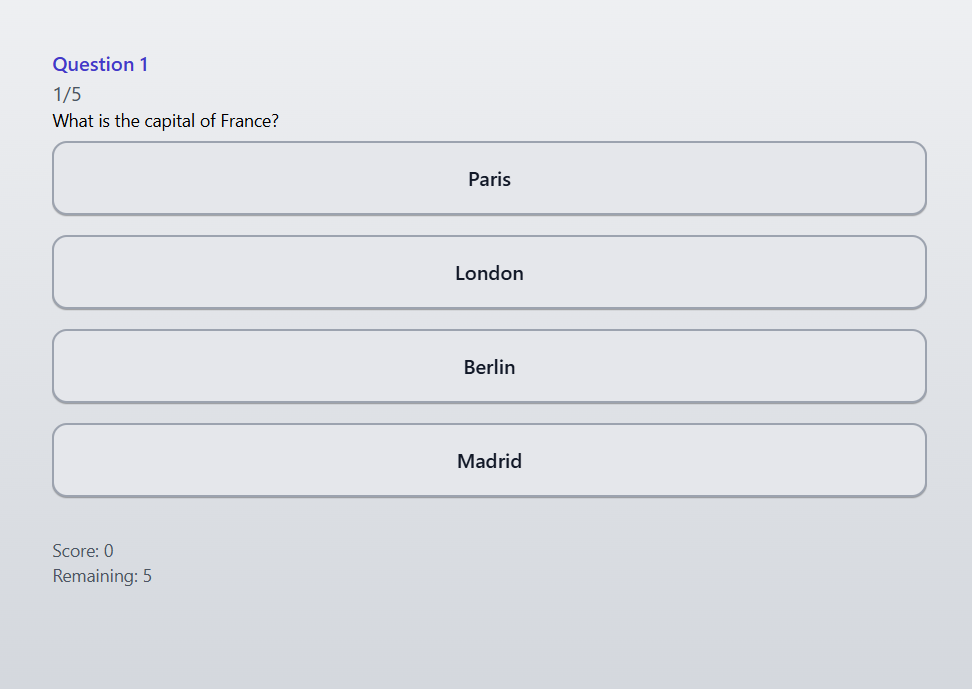
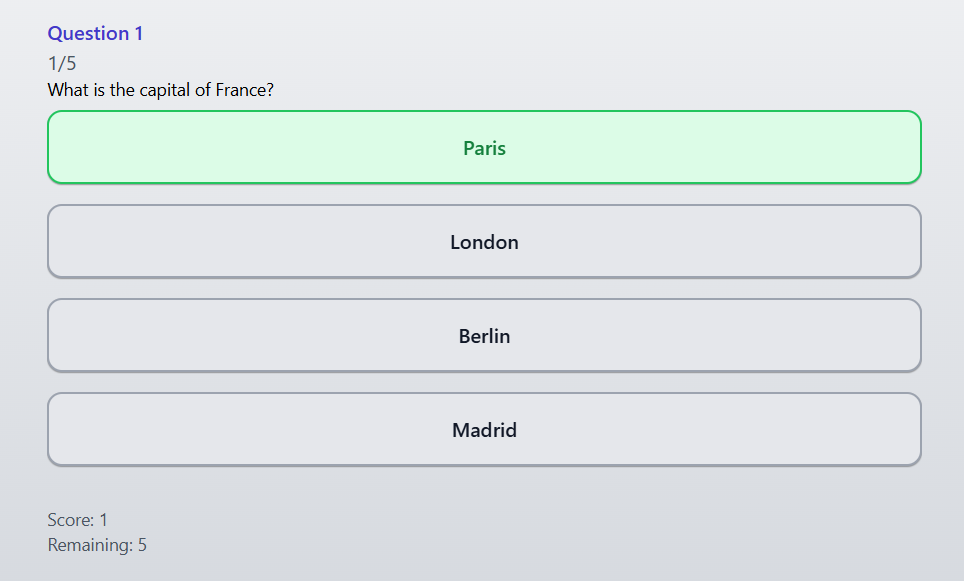
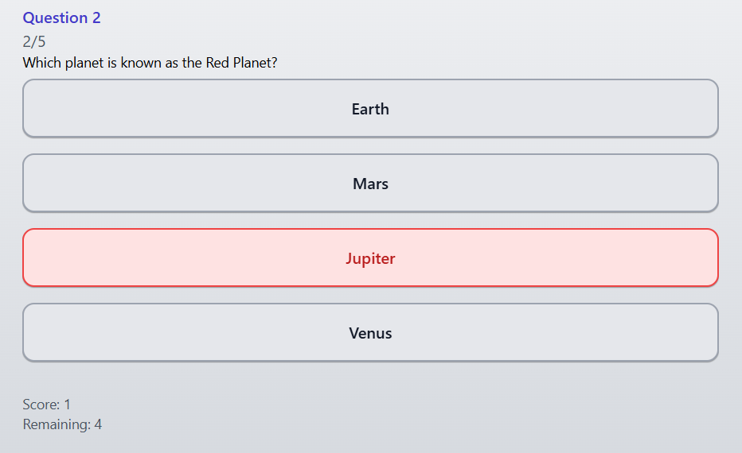

# 🏆 Quiz App - Pedro Eduardo Roel

> Project Status: Completed ✔️

---

### Table of Contents
* [Project Description](#project-description)
* [App Demo](#app-demo)
* [Features](#-features)
* [Technologies Used](#️-technologies-used)
* [How to Run Locally](#️-how-to-run-locally)
* [Additional Feature](#-additional-feature)
* [Author](#-author)

---

### Project Description
<p align="center">
This project is a cross-platform Quiz application developed with React Native and Expo as the final project for the programming course. The app features a quiz with instant feedback, a results screen, and the option to play again.
</p>

---

### App Demo

<p align="center">
   
</p>
<p align="center">
   
</p>
<p align="center">
   
</p>
<p align="center">
   
</p>

---

### 🚀 Features

- **Interactive Quiz:** Question and answer flow with validation.
- **Visual Feedback:** Answers are instantly marked as correct or incorrect.
- **Scoreboard:** Score is calculated and updated each round.
- **Results Screen:** At the end of the quiz, a screen displays the final score.
- **Play Again:** Users can restart the quiz from the results screen.
- **Additional Feature:** **Animations with NativeWind** (e.g., smooth transitions and feedback).

---

### 🛠️ Technologies Used

- **[React Native](https://reactnative.dev/)**
- **[Expo](https://expo.dev/)**
- **[TypeScript](https://www.typescriptlang.org/)**
- **[NativeWind](https://www.nativewind.dev/)**

---

### ⚙️ How to Run Locally

```bash
# 1. Clone the repository
$ git clone [your-repository-link]

# 2. Navigate to the project directory
$ cd quiz-app

# 3. Install dependencies
$ npm install

# 4. Start the development server
$ npm start
```
After running `npm start`, press `w` to open in the browser or scan the QR Code with the Expo Go app on your phone.

---

## ✨ Additional Feature: Animations with NativeWind

This section details the extra feature implemented as part of the final course challenge.

### Description
The Quiz App now includes smooth and visually appealing animations using the `NativeWind` library. Animations are applied to question transitions, answer feedback, and the results screen, enhancing the user experience. For example, questions and answers animate in and out, and feedback for correct or incorrect answers is highlighted with animated effects powered by utility classes.

### Challenges and Learnings
To implement these animations, I learned how to use `NativeWind` for styling and animation in React Native. The main challenge was coordinating animation timing with state changes, ensuring that feedback animations played before moving to the next question. Through this, I gained experience with utility-first styling and integrating animation utilities for a more dynamic interface.

---

### 👨‍💻 Author

Developed by **Pedro Eduardo Roel**.

Under the guidance of **Prof. Rafael Ribas**.